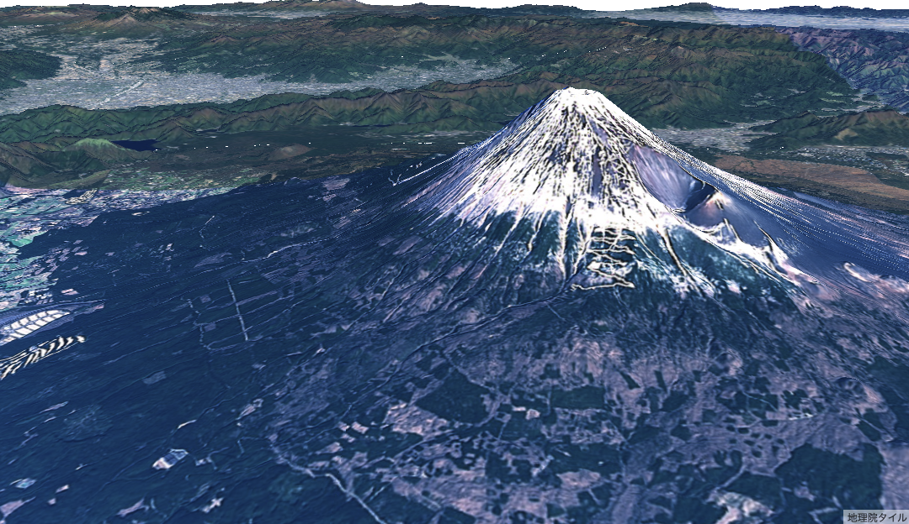

  [](https://codecov.io/gh/mug-jp/maplibre-gl-gsi-terrain)

# ドローン点検システム - MapLibre GL JS + 地理院地形



## 概要

このプロジェクトは、MapLibre GL JS と地理院地形データを使用した 3D ドローン点検シミュレーションシステムです。
東京タワー、富士山、大阪城、札幌時計台、能登半島など、日本の主要な地点でのドローン点検シミュレーションを提供します。

## 主な機能

### 🚁 フライトプラン管理

-   **動的フライトプラン**: 複数の地点に対応したフライトプランの読み込み・実行
-   **リアルタイム実行**: フライトプランの段階的実行とリアルタイムログ
-   **インポート/エクスポート**: JSON 形式でのフライトプランの保存・読み込み

### 📊 3D データ可視化

-   **地理院地形**: 高精度な日本の地形データを 3D 表示
-   **3D ポイント**: 点検ポイントの 3D 表示
-   **メッシュデータ**: 建物や構造物の 3D メッシュ表示
-   **ウェイポイント**: ドローンの飛行経路表示

### 📁 データ管理

-   **CSV/GeoJSON 対応**: 複数のデータ形式でのインポート・エクスポート
-   **統一フライトデータ**: 標準化されたフライトデータ形式
-   **軌跡データ**: 時系列でのドローン軌跡管理

### 🎮 インタラクティブ機能

-   **ドローン配置**: マップ上でのドローン配置
-   **オブジェクト編集**: ドラッグ&ドロップでのオブジェクト移動
-   **多角形描画**: 点検エリアの描画機能
-   **2D/3D 切り替え**: 表示モードの切り替え

## クイックスタート

### 1. プロジェクトのセットアップ

```bash
# リポジトリをクローン
git clone https://github.com/your-repo/maplibre-gl-gsi-terrain.git
cd maplibre-gl-gsi-terrain

# 依存関係をインストール
npm install
# または
pnpm install
```

### 2. 開発サーバーの起動

```bash
# 開発サーバーを起動
npm run dev
# または
pnpm dev
```

ブラウザで `http://localhost:5173` にアクセスしてください。

## 使用方法

### キーボードショートカット

| ショートカット | 機能 | 説明 |
| --- | --- | --- |
| `Ctrl + T` | 東京タワー フライトプラン読込 | 東京タワー点検フライトプランを読み込み（デフォルト） |
| `Ctrl + N` | 能登半島エリア | 能登半島エリアの 3D データとフライトプランを読み込み |
| `Ctrl + F` | 富士山 | 富士山点検フライトプランを読み込み |
| `Ctrl + O` | 大阪エリア | 大阪エリア点検フライトプランを読み込み |
| `Ctrl + S` | 札幌エリア | 札幌エリア点検フライトプランを読み込み |

### フライトプランの実行

1. **フライトプランの読み込み**

    - キーボードショートカットを使用
    - または「インポート」ボタンで JSON ファイルを選択

2. **フライトプランの開始**

    - 「開始」ボタンをクリック
    - ドローンが自動的にフライトプランを実行

3. **リアルタイムログの確認**
    - 画面下部のログパネルで実行状況を確認
    - 各フェーズの進行状況がリアルタイムで表示

### データのインポート/エクスポート

#### サポートされているデータ形式

-   **3D ポイントデータ**: CSV 形式（経度,緯度,高度,名前,タイプ）
-   **メッシュデータ**: CSV 形式（頂点座標と面情報）
-   **ウェイポイント**: CSV 形式（経度,緯度,高度,名前）
-   **フライトプラン**: JSON 形式（フェーズ情報）
-   **統一フライトデータ**: CSV/GeoJSON 形式
-   **軌跡データ**: CSV/GeoJSON 形式（時系列データ）

#### インポート手順

1. **CSV/GeoJSON ファイルのインポート**

    - 「CSV 入力」または「GeoJSON 入力」ボタンをクリック
    - ファイルを選択してアップロード

2. **フライトプランのインポート**

    - 「インポート」ボタンをクリック
    - JSON ファイルを選択

3. **サンプルデータの読み込み**
    - 各セクションの「サンプル」ボタンをクリック
    - 1 クリックでサンプルデータを読み込み

#### エクスポート手順

1. **データのエクスポート**

    - 「CSV 出力」または「GeoJSON 出力」ボタンをクリック
    - ファイルが自動的にダウンロード

2. **フライトプランのエクスポート**
    - 「エクスポート」ボタンをクリック
    - 現在のフライトプランが JSON 形式でダウンロード

## サンプルデータ

### 利用可能なサンプルデータ

#### フライトプラン

-   **東京タワー点検フライトプラン** (デフォルト)
-   **富士山点検フライトプラン** (`Ctrl + F`)
-   **大阪エリア点検フライトプラン** (`Ctrl + O`)
-   **札幌エリア点検フライトプラン** (`Ctrl + S`)
-   **能登半島エリア点検フライトプラン** (`Ctrl + N`)

#### 3D データ

-   **3D ポイントデータ**: 各地点の点検ポイント
-   **メッシュデータ**: 建物や構造物の 3D モデル
-   **ウェイポイント**: ドローンの飛行経路

#### 統一フライトデータ

-   **サンプルフライトデータ**: 東京タワー周辺の点検データ
-   **サンプル軌跡データ**: ドローンの飛行軌跡

### サンプルデータのダウンロード

サンプルデータは `example/data/` ディレクトリに格納されています：

```bash
# フライトプラン
example/data/fuji-mountain-flight-plan.json
example/data/osaka-castle-flight-plan.json
example/data/sapporo-clock-tower-flight-plan.json
example/data/noto-coast-waypoints.csv

# 3Dデータ
example/data/mock-3d-data.csv
example/data/mock-mesh-data.csv
example/data/mock-building-inspection-points.csv
example/data/mock-building-inspection-mesh.csv

# 統一フライトデータ
example/data/sample-flight-data.csv
example/data/sample-trajectory-data.csv
example/data/sample-mission-data.json
```

## 技術仕様

### 使用技術

-   **MapLibre GL JS**: 3D 地図表示ライブラリ
-   **地理院地形**: 日本の高精度地形データ
-   **TypeScript**: 型安全な JavaScript 開発
-   **Vite**: 高速な開発サーバーとビルドツール

### データ形式

#### フライトプラン JSON 形式

```json
{
  "name": "フライトプラン名",
  "description": "フライトプランの説明",
  "created": "2025-01-31T10:00:00.000Z",
  "phases": [
    {
      "phase": "フェーズ名",
      "action": "アクション説明",
      "duration": 3000,
      "position": [経度, 緯度, 高度]
    }
  ],
  "totalDuration": 39000
}
```

#### 3D ポイント CSV 形式

```csv
longitude,latitude,altitude,name,type
139.7454,35.6586,100,東京タワー,landmark
```

#### 統一フライトデータ CSV 形式

```csv
timestamp,longitude,latitude,altitude,drone_id,mission_id,status
2025-01-31T10:00:00Z,139.7454,35.6586,100,drone-001,mission-001,active
```

### アーキテクチャ

```
src/
├── terrain.ts          # 地理院地形プロトコル
├── data-import-export.ts # データインポート/エクスポート機能
└── worker.ts          # Web Worker処理

example/
├── index.ts           # メインアプリケーション
├── index.html         # UI
└── data/             # サンプルデータ
```

## 開発者向け情報

### 環境構築

```bash
# 依存関係のインストール
npm install

# 開発サーバーの起動
npm run dev

# ビルド
npm run build

# テストの実行
npm run test
```

### 新しいフライトプランの追加

1. **JSON ファイルの作成**

    ```json
    {
      "name": "新しいフライトプラン",
      "description": "説明",
      "phases": [...]
    }
    ```

2. **TypeScript ファイルに読み込み関数を追加**

    ```typescript
    const loadNewFlightPlan = async () => {
        const response = await fetch('./data/new-flight-plan.json')
        const flightPlanData: FlightPlanData = await response.json()
        // 処理...
    }
    ```

3. **キーボードショートカットの追加**
    ```typescript
    if (e.ctrlKey && e.key === 'x') {
        loadNewFlightPlan()
    }
    ```

### カスタマイズ

-   **地形データの変更**: `src/terrain.ts`で地形ソースを変更
-   **UI のカスタマイズ**: `example/index.html`で UI を変更
-   **データ形式の拡張**: `src/data-import-export.ts`で新しいデータ形式を追加

## ライセンス

このプロジェクトは MIT ライセンスの下で公開されています。

## 貢献

プルリクエストやイシューの報告を歓迎します。貢献する前に、以下の点を確認してください：

1. コードスタイルの統一
2. TypeScript の型安全性の確保
3. テストの追加（新機能の場合）

## 更新履歴

-   **v2.1.0**: ドローン点検システムの追加
-   **v2.0.0**: MapLibre GL JS v4 対応
-   **v1.0.0**: 初回リリース

## サポート

問題や質問がある場合は、GitHub のイシューページで報告してください。
